# 🔧 Tool Tracker — Tool Inventory & Custody

A tool inventory and custody system built to replace manual paper logs and spreadsheet tracking with a single source of truth. From one dashboard, staff search the catalog, check tools out to customers with return dates, record check-ins with notes, and review in-stock, overdue, and due-soon assignments — tracing every handoff through a full audit log with admin controls for inventory, customers, and users.

The system **eliminated manual paper and spreadsheet custody tracking**, turned spreadsheet-style custody into a **searchable, auditable web app**, with a complete digital audit trail on every check-in and check-out and a single dashboard for status, customers, and history.

---

## 🔧 Features

### 📊 Dashboard & Alerts

- Utilization stats: in stock, checked out, overdue, and due within 7 days
- Overdue and **Due soon** detail modals with customer and return-date context
- Recent checkout activity and top customers by tools out
- In-app overdue banner on every page when returns are past due

### 🔄 Check In / Out

- Search and filter tools by status (in stock / checked out)
- Assign checkout to a customer with expected return date and optional notes
- Check in with notes appended to the audit log
- View checkout notes inline from the operations table

### 👥 Custody & History

- **Tools by Customer** — search customers with open checkouts and drill into tool details
- **History** — filterable audit log (tool, customer, date range)
- Admins can delete individual records or clear all history

### 🛠️ Admin

- Tools CRUD (inventory fields, location, status)
- Customers CRUD (employee ID, name, specialization)
- User management (roles, active status, credentials)

### 🌍 Multilingual Experience

- Full English and Arabic UI via `next-intl`
- RTL / LTR layout with a globe toggle on login and in the app shell
- Localized validation, errors, and status labels

---

## 💡 Impact

- Turned a spreadsheet-style custody process into a searchable, auditable web app — replacing manual paper and spreadsheet logs
- Centralized status, customers, and history in a single dashboard — utilization, open custody, and audit records in one place
- Made tool and custody tracking ~90% easier — every handoff logged with timestamps, notes, and a complete digital audit trail
- Surfaced overdue and due-soon assignments before tools go missing

---

## 📦 Tech Stack

| Layer      | Tech                             |
| ---------- | -------------------------------- |
| Framework  | Next.js 15, React 19, TypeScript |
| i18n       | next-intl (English / Arabic)     |
| Database   | PostgreSQL 18, Drizzle ORM       |
| Auth       | Auth.js v5 (credentials)         |
| UI         | Tailwind CSS 4, shadcn/ui        |
| Deployment | Neon + Vercel                    |

---

## 🌐 Deployment Notes

- Fully responsive desktop and mobile layouts
- Demo database on Neon with wipe-and-reseed scripts (`npm run seed:demo` / `seed:demo:local`)
- Public demo hosted on Vercel from the `demo` branch; first load after idle may take a few seconds while Vercel and Neon wake
- Local capture uses Docker Postgres on port **5433** (`npm run seed:demo:local`)

---

## 🎬 Site Demo

**[▶ Watch site walkthrough](./docs/tooltracker-demo.mp4)** (~1¼ min)

Login → Arabic dashboard glance → checkout **TT-010** to **EMP-01** → **Tools by Customer** search → dashboard scroll and **Due in 7 days** modal → filter checked-out tools and check in with notes → **Users** → **History**.

---

## 📸 Screenshots

<table>
  <tr>
    <td width="50%" valign="top">
      <strong>Login</strong> 
      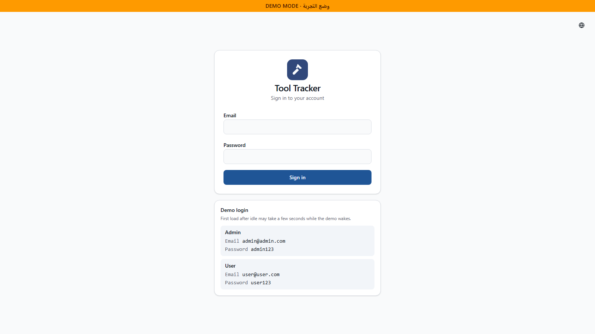
    </td>
    <td width="50%" valign="top">
      <strong>Dashboard</strong> 
      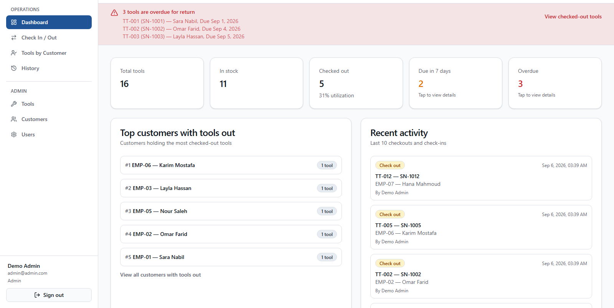
    </td>
  </tr>
  <tr>
    <td width="50%" valign="top">
      <strong>Due Soon Modal</strong> 
      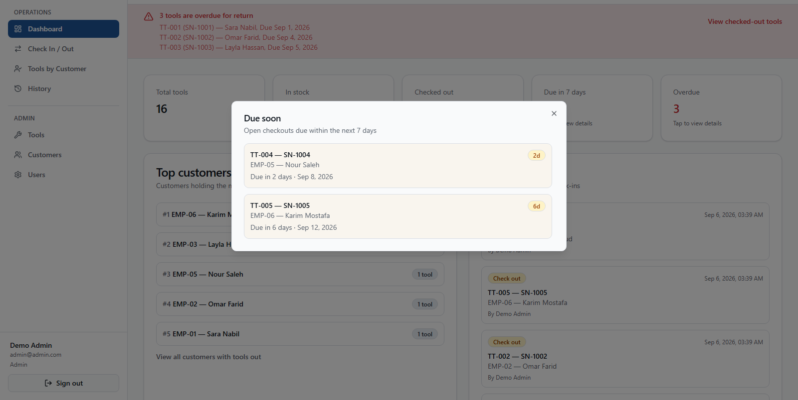
    </td>
    <td width="50%" valign="top">
      <strong>Check In / Out</strong> 
      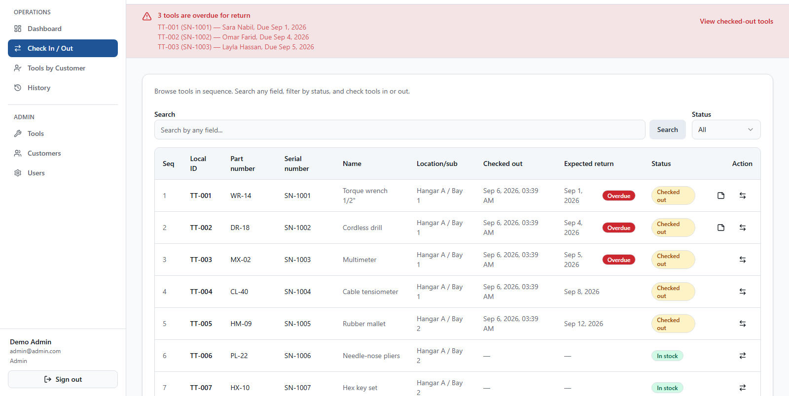
    </td>
  </tr>
  <tr>
    <td width="50%" valign="top">
      <strong>Checkout Dialog</strong> 
      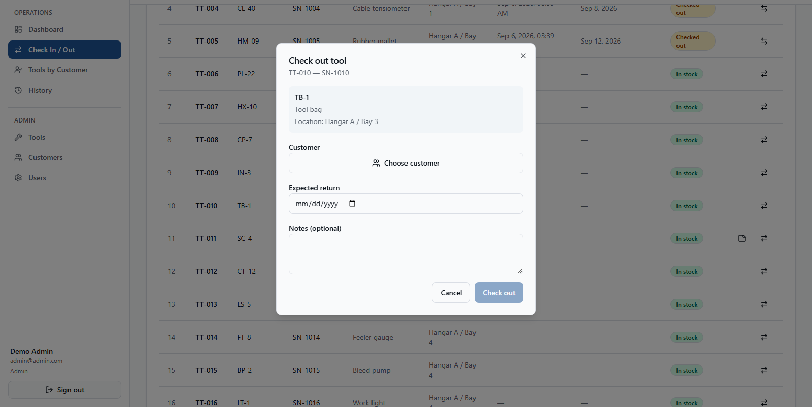
    </td>
    <td width="50%" valign="top">
      <strong>Tools by Customer</strong> 
      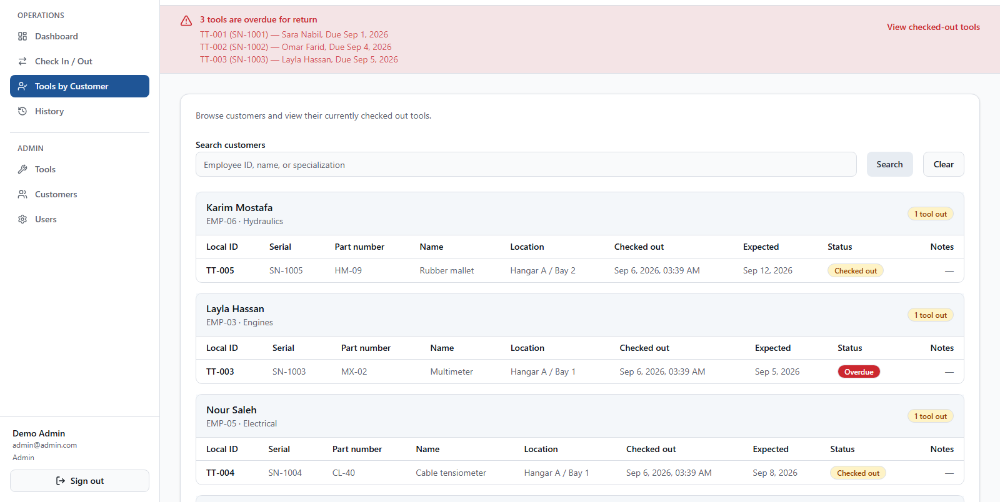
    </td>
  </tr>
  <tr>
    <td width="50%" valign="top">
      <strong>History</strong> 
      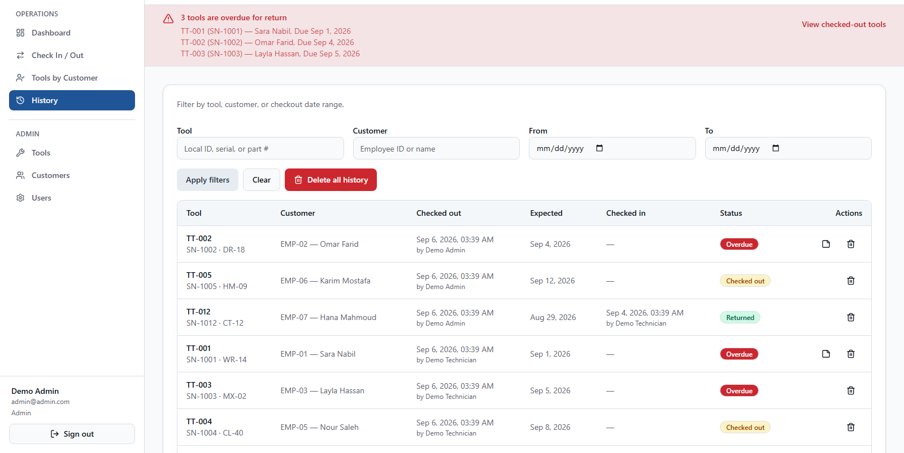
    </td>
    <td width="50%" valign="top">
      <strong>Admin — Tools</strong> 
      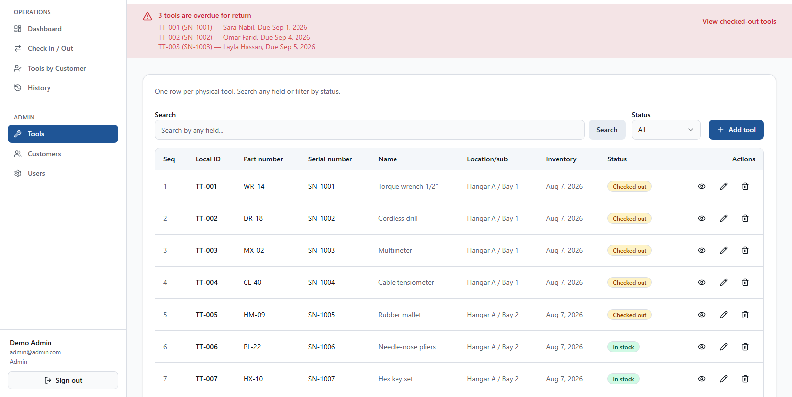
    </td>
  </tr>
  <tr>
    <td width="50%" valign="top">
      <strong>Admin — Customers</strong> 
      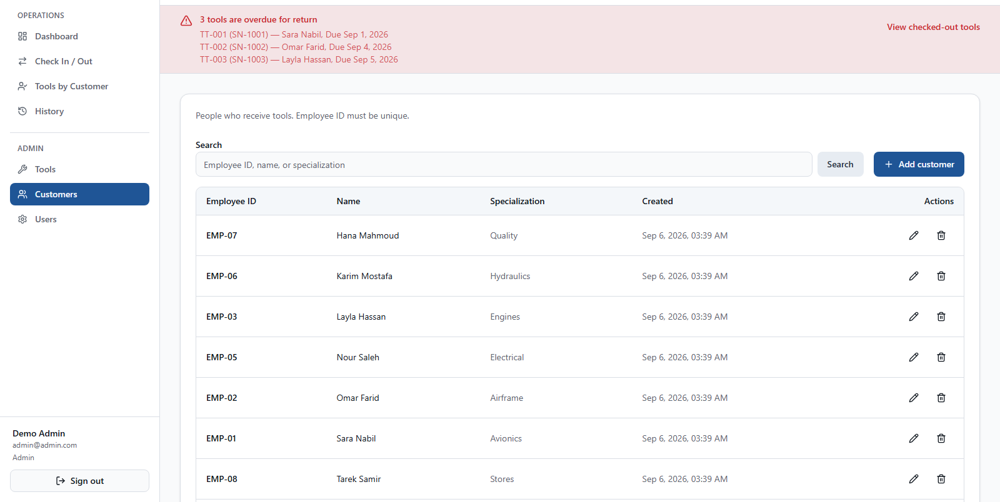
    </td>
    <td width="50%" valign="top">
      <strong>Admin — Users</strong> 
      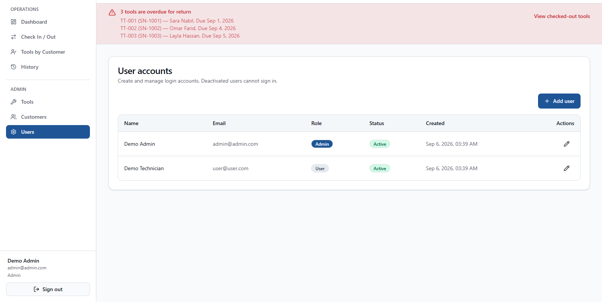
    </td>
  </tr>
  <tr>
    <td width="50%" valign="top">
      <strong>Arabic Login</strong> 
      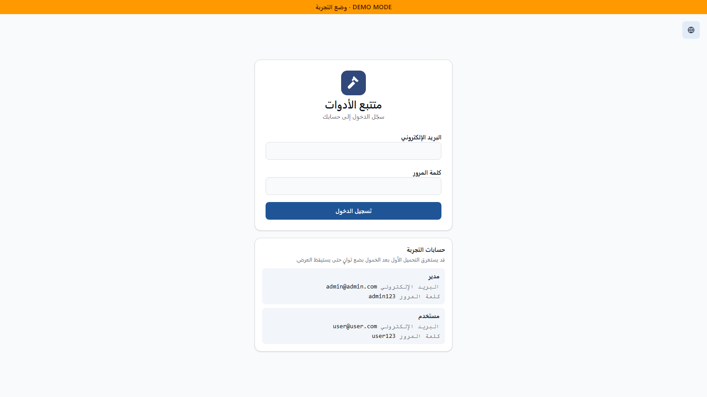
    </td>
    <td width="50%" valign="top">
      <strong>Mobile Login</strong> 
      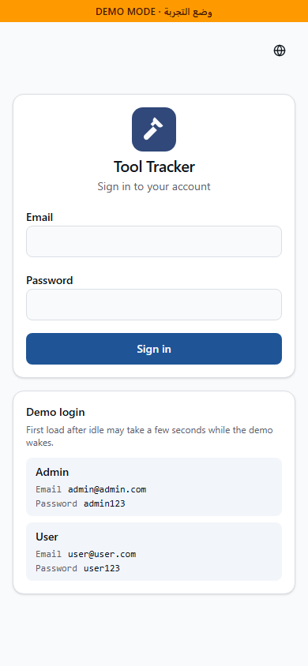
    </td>
  </tr>
  <tr>
    <td colspan="2" valign="top">
      <strong>Mobile Dashboard</strong> 
      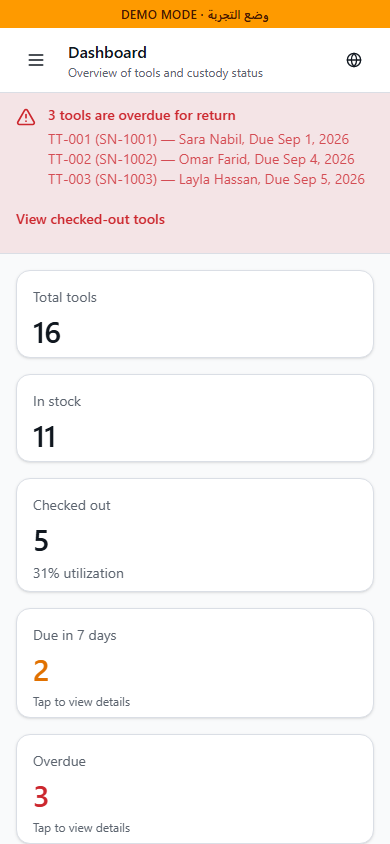
    </td>
  </tr>
</table>

## Live Demo 🚀

[**View Live Demo**](https://tooltracker-demo.vercel.app)

| Role  | Email           | Password |
| ----- | --------------- | -------- |
| Admin | admin@admin.com | admin123 |
| User  | user@user.com   | user123  |

---

## Author

👤 **Omar Mahmoud**
📧 [omrmhd54@gmail.com](mailto:omrmhd54@gmail.com)
💼 [LinkedIn](https://www.linkedin.com/in/omrmhd5/)
🌐 [Portfolio](https://omarmahmoud.dev/)
🔗 [GitHub](https://github.com/omrmhd5)
